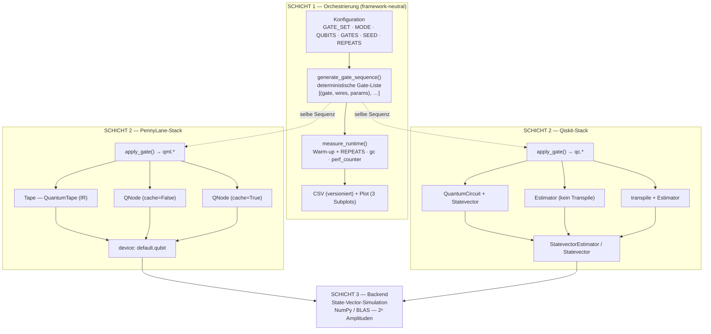

# Gesamtarchitektur des Benchmarking-Systems

Vergleich des **Abstraktions-Overheads** zweier Quantum-Frameworks (PennyLane & Qiskit)
von der bequemen High-Level-API bis hinunter zur reinen State-Vector-Simulation im Backend.

Die Kernfrage des Systems:
> *Wie viel Laufzeit kostet jede Abstraktionsschicht, die zwischen der Circuit-Beschreibung
> des Nutzers und der rohen linearen Algebra des Simulators liegt?*

Dazu wird **dieselbe, deterministisch erzeugte Gate-Sequenz** durch je drei
Abstraktionsebenen pro Framework geschickt und in drei Modi (`creation`,
`execution`, `gradient`) zeitlich vermessen.

---

## 1. Schichtenüberblick

```
┌───────────────────────────────────────────────────────────────────────────┐
│  SCHICHT 1 — ORCHESTRIERUNG            (identisch für beide Frameworks)     │
│                                                                            │
│  Konfiguration  ·  generate_gate_sequence()  ·  measure_runtime()          │
│  Benchmark-Schleife (Qubits × Gates)  ·  CSV (versioniert)  ·  Plot        │
└───────────────────────────────────────────────────────────────────────────┘
                                   │
                framework-neutrale Gate-Sequenz
                  [ (gate_name, wires, params), … ]
                                   │
           ┌───────────────────────┴───────────────────────┐
           ▼                                                ▼
┌────────────────────────┐                    ┌────────────────────────┐
│  SCHICHT 2 — PENNYLANE │                    │  SCHICHT 2 — QISKIT    │
│  apply_gate() → qml.*  │                    │  apply_gate() → qc.*   │
│                        │                    │                        │
│   Tape   QNode  QNode  │                    │   QC+SV   Est   Est+T  │
│         (no c.) (cach) │                    │         (prim) (transp)│
│    ▲       ▲      ▲     │                    │    ▲       ▲      ▲     │
│  niedrig ───► hoch     │                    │  niedrig ───► hoch     │
│  (Abstraktionsgrad)    │                    │  (Abstraktionsgrad)    │
└────────────────────────┘                    └────────────────────────┘
           │                                                │
           ▼                                                ▼
┌────────────────────────┐                    ┌────────────────────────┐
│  device:default.qubit  │                    │ Statevector /          │
│                        │                    │ StatevectorEstimator   │
└────────────────────────┘                    └────────────────────────┘
           │                                                │
           └───────────────────────┬────────────────────────┘
                                   ▼
┌───────────────────────────────────────────────────────────────────────────┐
│  SCHICHT 3 — BACKEND                                                       │
│  State-Vector-Simulation · NumPy / BLAS · 2ⁿ komplexe Amplituden          │
└───────────────────────────────────────────────────────────────────────────┘
```

Dasselbe als Mermaid-Diagramm (rendert in VS Code / GitHub):



---

## 2. Schicht 1 — Orchestrierung (framework-neutral)

Diese Schicht ist in beiden Skripten (`logarithmic_benchmark_pennylane.py`,
`logarithmic_benchmark_qiskit.py`) **strukturell identisch** und enthält keinerlei
Framework-spezifische Quanten-Logik. Sie sorgt für faire, reproduzierbare Vergleiche.

| Komponente | Aufgabe | Fairness-Garantie |
|---|---|---|
| **Konfiguration** | `GATE_SET_CHOICE`, `BENCHMARK_MODE`, `QUBIT_CONFIGS`, `GATE_CONFIGS`, `SEED`, `REPEATS` | Beide Frameworks bekommen exakt dieselben Parameter |
| **`resolve_gate_set()`** | Auswahl-String → konkrete Gatterliste | Identische Gatter-Auswahl |
| **`generate_gate_sequence()`** | Erzeugt aus `SEED` eine deterministische Liste `(gate_name, wires, params)` | **Bit-identische Sequenz** in beiden Stacks |
| **`measure_runtime()`** | 1× Warm-up, dann `REPEATS`× messen mit `gc.collect()` + `perf_counter` | Gleiche Messmethodik, gleiche Statistik (avg/std/min/max) |
| **Benchmark-Schleife** | Kreuzprodukt `QUBIT_CONFIGS × GATE_CONFIGS` | Gleicher Messraster |
| **CSV + Plot** | Versionierte Ergebnisse, 3 Subplots = 3 Abstraktionsebenen | — |

**Zentrale Designentscheidung:** Die Gate-Sequenz ist eine **neutrale Zwischenrepräsentation**.
Sie kennt weder `qml.*` noch `qc.*`, sondern nur abstrakte Tripel. Erst `apply_gate()`
in Schicht 2 übersetzt sie in die jeweilige Framework-API. Dadurch misst der Benchmark
ausschließlich den Framework-Overhead — nicht Unterschiede in der erzeugten Schaltung.

`GATE_CONFIGS` ist **logarithmisch** verteilt (10 … 100 000 Gatter, 20 Punkte), damit
das Skalierungsverhalten über vier Größenordnungen mit gleichmäßiger Punktdichte
sichtbar wird.

---

## 3. Schicht 2 — Framework-Abstraktion (die Vergleichsachse)

Das Herz des Systems. Jedes Framework wird über **drei Ebenen mit steigendem
Abstraktionsgrad** angesprochen. Die Übersetzung der neutralen Sequenz erfolgt in
`apply_gate()` (1:1-Mapping der Gatter).

### 3.1 PennyLane-Ebenen

| Ebene | Abstraktionsgrad | Was passiert | Backend-Aufruf |
|---|---|---|---|
| **Tape** | niedrig | `QuantumTape` (Intermediate Representation) direkt befüllen — kein Python-Tracing, kein QNode-Wrapper | `qml.execute([tape], dev)` |
| **QNode (no cache)** | hoch | Normale Python-Funktion; PennyLane *tracet sie bei jedem Aufruf neu* in ein Tape und dispatcht | `circuit()` |
| **QNode (cached)** | hoch | Wie oben, aber das getracte Tape wird **gecacht** → Tracing-Overhead nur einmal | `circuit()` |

Abstraktions-Gradient: `Tape  ──►  QNode(no cache)  ──►  QNode(cached)`
Das Tape ist „näher am Backend", der QNode ist die bequeme, dekorator-basierte
Nutzer-API. Der Vergleich Tape ↔ QNode isoliert den **Tracing-/Dispatch-Overhead**;
der Vergleich no-cache ↔ cached isoliert den **Caching-Gewinn**.

### 3.2 Qiskit-Ebenen

| Ebene | Abstraktionsgrad | Was passiert | Backend-Aufruf |
|---|---|---|---|
| **QC + Statevector** | niedrig | `QuantumCircuit` bauen, State-Vektor direkt evolvieren — kein Primitiv | `Statevector(qc).expectation_value(obs)` |
| **Estimator** | hoch | Estimator-Primitiv (hardware-orientierte API): nimmt `(circuit, observable)`, liefert Erwartungswert; Simulation intern | `estimator.run([(qc, obs)])` |
| **Estimator + transpile** | hoch | Zusätzlich wird der Circuit vor Ausführung in Basis-Gatter **kompiliert/optimiert** (`optimization_level=1`) | `estimator.run([(tc, obs)])` |

Abstraktions-Gradient: `QC+Statevector  ──►  Estimator  ──►  Estimator+transpile`
Roh-`Statevector` ist „näher am Backend", das Estimator-Primitiv ist die empfohlene
High-Level-API. Der Vergleich isoliert den **Primitiv-Overhead**; das zusätzliche
`transpile` zeigt die **Kompilierungskosten**, wie sie für echte Hardware anfielen.

### 3.3 Konzeptionelle Entsprechung der Ebenen

| Rolle | PennyLane | Qiskit |
|---|---|---|
| Niedrigste Ebene (nah am Backend) | **Tape** (IR direkt) | **QuantumCircuit + Statevector** |
| High-Level-API ohne Kompilierung | **QNode (no cache)** | **Estimator** |
| High-Level-API mit Optimierung | **QNode (cached)** | **Estimator + transpile** |

> Hinweis: Die Entsprechung ist *konzeptionell*, nicht mechanisch identisch — PennyLanes
> Optimierung ist Graph-**Caching**, Qiskits Optimierung ist Gate-**Transpilation**.
> Genau diese unterschiedliche Natur „derselben" obersten Ebene ist ein interessantes
> Ergebnis des Vergleichs.

---

## 4. Schicht 3 — Backend (State-Vector-Simulation)

Beide Stacks enden im selben Rechenmodell: **exakte State-Vector-Simulation** auf der CPU.

| Framework | Backend-Komponente | Modell |
|---|---|---|
| PennyLane | `default.qubit` | State-Vektor mit 2ⁿ komplexen Amplituden, Gatter als Tensor-Kontraktionen (NumPy) |
| Qiskit | `Statevector` / `StatevectorEstimator` | Referenz-Primitiv, State-Vektor-Evolution (NumPy) |

Da beide letztlich `NumPy`/`BLAS` auf demselben 2ⁿ-State-Vektor ausführen, ist die
**reine Simulationsarbeit vergleichbar** — gemessene Laufzeitunterschiede stammen
überwiegend aus den darüberliegenden Abstraktionsschichten. Genau das ist die
Voraussetzung dafür, dass der Benchmark den *Abstraktions-Overhead* überhaupt isolieren kann.

---

## 5. Die drei Benchmark-Modi (orthogonal zu den Ebenen)

Jede Abstraktionsebene wird in einem von drei Modi vermessen. Der Modus bestimmt,
*welcher Teil* des Stacks gemessen wird:

| Modus | Misst | Welche Schichten sind „heiß" |
|---|---|---|
| **`creation`** | Aufbau des Circuits / erster Trace | Schicht 2 (Aufbau), ohne Simulation |
| **`execution`** | reine Simulation nach dem Aufbau | Schicht 2 (Dispatch) → Schicht 3 |
| **`gradient`** | Gradient via Parameter-Shift (`RY(θᵢ)` je Qubit) | Schicht 2 + n× Schicht-3-Aufrufe |

Ebenen × Modi spannen die Messmatrix auf: pro `(Qubits, Gatter)`-Punkt werden drei
Ebenen gemessen, über drei Modi hinweg, für zwei Frameworks.

---

## 6. Datenfluss eines einzelnen Messpunkts

```
(num_qubits, total_gates)
        │
        ▼
generate_gate_sequence(seed=42)        ← Schicht 1, framework-neutral
        │   [(gate, wires, params), …]
        ├───────────────────────────────┬───────────────────────────────┐
        ▼                               ▼                               ▼
 build_<level>_A()              build_<level>_B()              build_<level>_C()   ← Schicht 2
 (z. B. Tape)                   (z. B. QNode nc)               (z. B. QNode c)
        │                               │                               │
        ▼ measure_runtime()             ▼ measure_runtime()             ▼ measure_runtime()
   {avg,std,min,max}              {avg,std,min,max}              {avg,std,min,max}   ← Schicht 1
        └───────────────────────────────┴───────────────────────────────┘
                                        │
                                        ▼
                          eine CSV-Zeile (+ später Plot)
```

`measure_runtime()` löst dabei implizit Schicht 3 aus (außer im `creation`-Modus,
der vor der Simulation stoppt).

---

## 7. Verzeichnis- & Datei-Zuordnung

| Datei | Schicht | Rolle |
|---|---|---|
| `Benchmarks/logarithmic_benchmark_pennylane.py` | 1 + 2 + 2→3 | Orchestrierung + PennyLane-Ebenen |
| `Benchmarks/logarithmic_benchmark_qiskit.py` | 1 + 2 + 2→3 | Orchestrierung + Qiskit-Ebenen |
| `Benchmarks/plot_results.py` / `replot_results.py` | 1 | Nachträgliches Plotten aus CSV |
| `Results/<Framework>/*.csv`, `*.png` | Output | Versionierte Messergebnisse |
| `requirements.txt`, `Setup.txt` | — | Umgebung & Ausführung |

---

## 8. Zusammenfassung in einem Satz

Eine **framework-neutrale Orchestrierungsschicht** speist eine **deterministische Gate-Sequenz**
durch je **drei Abstraktionsebenen** zweier Frameworks (PennyLane: Tape → QNode; Qiskit:
QuantumCircuit → Estimator) hinab bis zur **gemeinsamen State-Vector-Simulation** und misst
auf jeder Ebene die Laufzeit — und macht so den reinen *Kostenaufschlag jeder Abstraktion*
sichtbar.
